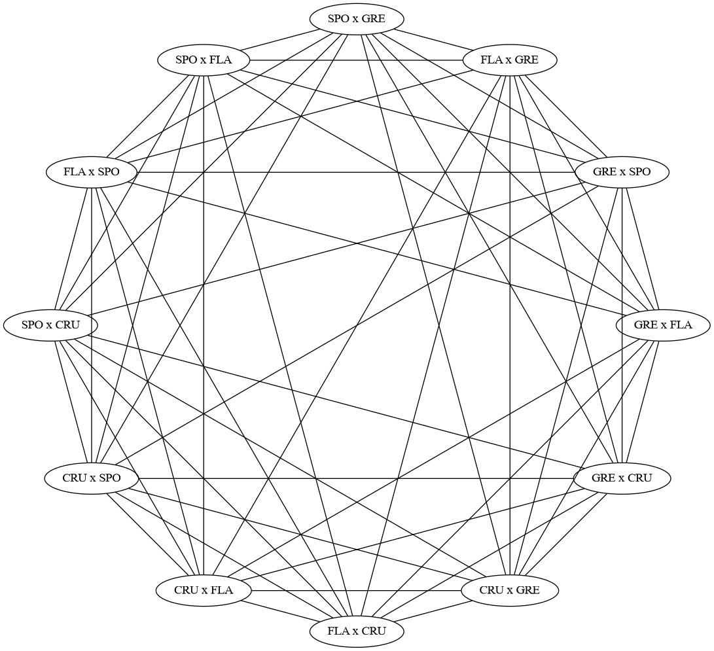

## Geração do Grafo de Conflitos para o mTTP

O material dessa pasta implementa a geração do grafo de conflitos para o
problema mTTP. Essa descrição não está muito clara no artigo de Carvalho e
Lorena (2012), então estou divulgando uma implementação bem _dummy_ de um
gerador desse tipo de grafo.

O script [geraConflictGraph.py](geraConflictGraph.py) aceita como entrada uma
instância do problema, e grava dois arquivos: um `.dot` e outro `.txt`. O
primeiro arquivo pode ser utilizado como entrada do software Graphviz, e serve
para visualizar o grafo de conflitos em uma representação bonitinha. Já incluí
o arquivo [carvalho-exemplo.dot](carvalho-exemplo.dot), que renderiza o mesmo
grafo do artigo de referência. Para executar o software, use a linha de comando
a seguir.

```bash
   $ circo carvalho-exemplo.dot -Tpdf > out.pdf
```

Esse comando deve gerar uma saída semelhante ao _output_ abaixo.



O arquivo de texto armazena o grafo de conflitos gerado, listando as partidas
geradas e as arestas que existem no grafo. Na primeira linha do arquivo, são
dispostos o número de vértices do grafo, e o número de arestas. Em seguida, são
listadas os vértices dos grafos, um por linha, seguidos das arestas, uma por
linha também. No arquivo abaixo ([gc-N4.txt](gc-N4.txt)) são apresentados 
`12` vértices e `108` arestas, e é baseado na instância 
[N4](../instancias/mttp/N4.txt) do problema.

```
   12 108
   0 1
   1 0
   0 2
   2 0
   0 3
   3 0
   1 2
   2 1
   1 3
   3 1
   2 3
   3 2
   0 1
   0 2
   0 3
   0 4
   0 5
   0 6
   0 7
   0 8
   0 9
   1 2
   1 3
   1 4
   1 5
   1 6
   1 7
   1 8
   1 9
   2 3
   2 4
   2 5
   2 6
   2 7
   2 10
   2 11
   3 4
   3 5
   3 6
   3 7
   3 10
   3 11
   4 5
   4 8
   4 9
   4 10
   4 11
   5 8
   5 9
   5 10
   5 11
   6 7
   6 8
   6 9
   6 10
   6 11
   7 8
   7 9
   7 10
   7 11
   8 9
   8 10
   8 11
   9 10
   9 11
   10 11
```

